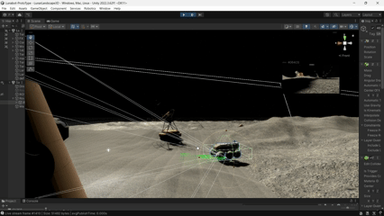

# 🌑 LunaBot: Autonomous Lunar Rover Prototype

[](http://wiki.ros.org/noetic) 
[](https://unity.com/) 
[](https://www.python.org/) 
[](https://flask.palletsprojects.com/)

**LunaBot** is a distributed autonomous system designed to simulate lunar exploration in high-fidelity environments. It bridges the gap between **Unity 3D physics** and **ROS 1 navigation stacks**, featuring a custom Sim-to-Real pipeline, semantic perception (YOLOv8), and a real-time telemetry dashboard.

> **Key Innovation:** Unlike standard Gazebo simulations, LunaBot utilizes a custom C# bridge to handle coordinate synchronization (Left-Handed vs. Right-Handed), sensor noise simulation, and wheel-slip physics on lunar regolith.


##  System Demo

[](https://github.com/user-attachments/assets/eb245942-7f71-4e28-91c5-c25168cb870c)


##  System Architecture

The project operates as a distributed system across three distinct layers, communicating via high-throughput **TCP/WebSockets**.

| Layer | Component | Function |
| :--- | :--- | :--- |
| **Simulation** | **Unity 3D** (Windows) | Physics engine, LiDAR/Depth sensor emulation, terrain interaction. |
| **Control** | **ROS Noetic** (WSL/Ubuntu) | SLAM (RTAB-Map), Semantic Perception (YOLO), Navigation. |
| **Interface** | **Flask + React** (Web) | Mission control, telemetry visualization, manual override. |

### Data Flow Diagram
The system utilizes a hybrid architecture where Unity generates sensor data, ROS processes it for autonomy, and Flask visualizes the state.


## Key Features
### 1. Advanced Sim-to-Real Bridge

- **Coordinate Synchronization:** Implements a custom C# transform layer to map Unity's Left-Handed (Y-Up) system to ROS's Right-Handed (Z-Up) system, strictly adhering to REP-103 standards.

- **Custom Sensor Drivers:**

   - **LiDAR:** Raycast-based scanning (180 rays) serialized to standard `sensor_msgs/LaserScan` messages.

   - **Depth Camera:** Shader-based depth extraction encoded to `32FC1` format for compatibility with RealSense drivers.

### 2. Perception & Autonomy

- **RGB-D SLAM:** Utilizes RTAB-Map for simultaneous localization and mapping, featuring visual bag-of-words loop closure.

- **Semantic Fusion:** Integrates YOLOv8 bounding boxes with depth data to project 2D detections into 3D semantic markers via the `/semantic_annotator` node.

Reactive Navigation: Uses a custom `goal_based_avoider` to handle dynamic obstacles without the computational overhead of the full `move_base` stack.

### 3. Low-Latency Dashboard

- **Architecture:** Built on a hybrid HTTP + WebSocket foundation using Flask and Flask-SocketIO.

- **Performance:** Capable of handling high-frequency topics (e.g., 50Hz Odom) through server-side rate limiting and JPEG map compression.

- **Features:** Provides real-time occupancy grid visualization, semantic overlays, and system health monitoring (CPU/GPU temps).

## Performance Benchmarks

Metrics were captured during full autonomous operation (SLAM + YOLO + Nav) running on a **Lenovo LOQ 15IAx9**.

|Metric	| Value |	Notes
| :--- | :--- | :--- |
|Total CPU Load	| ~10–15% |	High efficiency with significant headroom
|Inference Speed |	12–15 ms |	YOLOv8 inference time per frame
|End-to-End Latency	| < 50 ms |	Total time from Perception to Actuation
|Depth Stream |	30 FPS | Encoded in 32FC1 format

## Repository Structure
The project follows a standard catkin workspace structure combined with Unity assets.

```Plaintext
LunaBot_Prototype/
├── catkin_ws/                  # ROS Noetic Workspace
│   ├── src/
│   │   ├── luna_bot_ros/       # Main autonomy nodes (Python)
│   │   ├── messages/           # Custom ROS msg definitions
│   │   └── ...
├── LunaBotDashboard/           # Web Interface
│   ├── app.py                  # Flask entry point
│   ├── static/                 # JS/CSS assets
│   └── templates/              # HTML views
├── LunaBot-Unity/              # Unity Project Files (Assets/Scenes)
├── docs/                       # Technical Documentation
│   ├── architecture.md
│   ├── performance.md
│   └── ...
├── start_project.sh            # One-click launch script
├── stop_project.sh             # Cleanup script
└── requirements.txt            # Python dependencies
```

## Installation & Setup

For detailed instructions, please refer to [docs/setup.md](setup.md)


Prerequisites
|Component	| Version |	Note
| :--- | :--- | :--- |
|OS | Ubuntu 20.04 | WSL2 is recommended
|ROS	| Noetic Ninjemys | Required for the autonomy stack
|Unity | 2022.3.62f1 (LTS) | Required for physics simulation

### Quick Start
1. **Clone the Repository**

```Bash
git clone https://github.com/PraveenAmujuri/LunaBot_Prototype.git
cd LunaBot_Prototype
```
2. **Install Dependencies**
```Bash
# System dependencies
sudo apt-get install ros-noetic-rtabmap-ros ros-noetic-rosbridge-suite

# Python dependencies
pip3 install -r ros_requirements.txt
```
3. **Build ROS Workspace**

```Bash
cd catkin_ws && catkin_make
source devel/setup.bash
```
 4. **Launch the System Open Unity and press Play, then run the automation script in your terminal:**
 
```Bash
chmod +x start_project.sh
./start_project.sh
```
Access the dashboard at `http://localhost:5000`

## Documentation
Detailed technical breakdowns are available in the docs/ directory:

- [Architecture](docs/architecture.md)
- [ROS Pipeline](docs/ros_pipeline.md)
- [Unity Pipeline](docs/unity_pipeline.md)
- [Performance](docs/performance.md)
- [API Endpoints](docs\api__endpoints.md)

## License
This project is licensed under the MIT License - see the [LICENCE](LICENSE)
 file for details.

**Author:** [PraveenAmujuri](https://www.linkedin.com/in/sai-praveen-amujuri-738bb4358/)